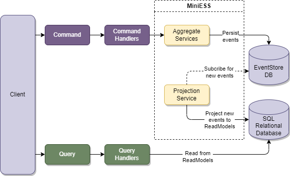
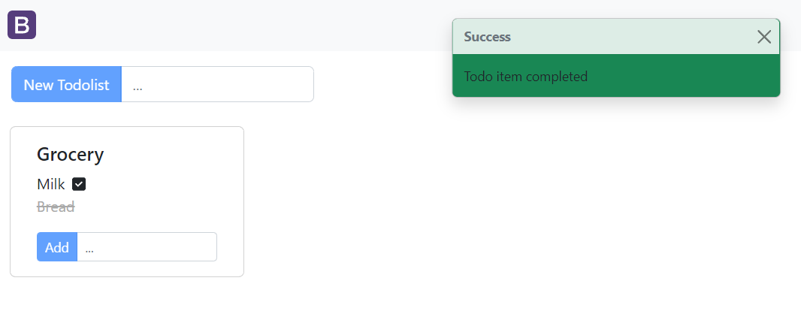

# MiniESS

MiniESS is an Event Sourcing micro-framework that uses EventStoreDB as the event store and Entity Framework Core to manage the read database.

## Motivations

MiniESS was created as a learning exercise to understand the internal workings of the event sourcing architecture. It uses off-the-shelf products such as EventStoreDB to manage events and event subscriptions.



## To run the Todo list sample application:

1. Run `docker-compose up` 
2. Navigate to `localhost:8090`

Alternatively, if you want to run the application from the IDE or from the host machine:

1. Run `docker-compose -f docker-compose.db-only.yml up`.
2. `Navigate to localhost:8090`.



You can also navigate to `localhost:2113` to interact with the EventStoreDB UI.

## Getting Started

The (micro-)framework is still under development and is in its early stages, so the packages have not yet been published for public use. However, the source code is available in this repository. 

For a full working example with a React frontend, see the `MiniESS.Todo` project.

To use MiniESS, you need to register the following services:

```cs
builder.Services.AddEventSourcing(option =>
{
    option.ConnectionString = eventStoreDbConnStr; 
    option.SerializableAssemblies = eventStoreSerializationAssemblies;
}).AddProjectionService();
```

`SerializableAssemblies` are the assemblies of the domain events that need to be serialized.
`AddProjectionService` enables the background service that manages projections from new events.

Note: you need to configure the EF Core DbContext yourself, as shown below:

```cs
builder.Services.AddDbContext<TodoDbContext>(options => options.UseSqlServer(builder.Configuration.GetConnectionString("MiniEssDb")));
```

### Write Models

With MiniESS, write models inherits from the `BaseAggregateRoot<T>` class.

To begin, register your write models with the service collections. This will register the corresponding Aggregate Repository used for persisting write-models.

```cs
builder.Services.AddEventSourcingRepository<TodoListAggregateRoot>();
```

Note: A private constructor with an argument `Guid streamId` is required for the framework to create and rehydrate the write-models.

```cs
public class TodoListAggregateRoot : BaseAggregateRoot<TodoListAggregateRoot>
{
    private TodoListAggregateRoot(Guid streamId) : base(streamId)
    {
    }

    private TodoListAggregateRoot(Guid streamId, string title) : base(streamId)
    {
        if (title.Length == 0)
            throw new DomainException("Title cannot be null or empty for a Todo List");
        
        AddEvent(new TodoListEvents.TodoListCreated(this, title));
    }

    ...
```

You must implement the `IHandleCommand` and `IHandleEvent` interfaces provided by the framework, to be able to interact with the aggregate:

```cs
public class TodoListAggregateRoot : 
    BaseAggregateRoot<TodoListAggregateRoot>,
    IHandleCommand<TodoListCommands.Create>,
    IHandleEvent<TodoListEvents.Created>
{
    ...

    public void Handle(TodoListCommands.Create command)
    {
        if (command.Title.Length == 0)
            throw new DomainException("Title cannot be null or empty for a Todo List");
        
        
        RaiseEvent(new TodoListEvents.Created(this, command.Title));
    }

    ...

    public void Handle(TodoListEvents.Created domainEvent)
    {
        Title = domainEvent.Title;
        TodoItems = new List<TodoItemAggregate>();
    }

    ...
}
```

Using the above implementation, the client may manipulate an aggregate using the command processor:

```cs
public AddTodoListHandler(CommandProcessor commandProcessor)
{
    _commandProcessor = commandProcessor;
}

public async Task<AddTodoListResponseModel> Handle(
    AddTodoListInputModel request, 
    CancellationToken cancellationToken)
{
    var streamId = Guid.NewGuid();
    await _commandProcessor.ProcessAndCommit(
        new TodoListCommands.Create(streamId, request.Title), 
        cancellationToken);

    return new AddTodoListResponseModel { CreatedTodoListId = streamId };
}
```

## Read Models

With MiniESS, read model projectors inherit from the `ProjectorBase<T>` class.

To begin, register your write models with the service collections. This will register the corresponding projectors used by the framework.

```cs
builder.Services.AddProjector<TodoListAggregateRoot, TodoListProjector>();
```

Next, implement your projector, and the corresponding interfaces for each event that your projector needs to handle.

```cs
public class TodoListProjector :
    ProjectorBase<TodoListAggregateRoot>,
    IProject<TodoListEvents.TodoListCreated>,
    IProject<TodoListEvents.TodoItemAdded>,
    IProject<TodoListEvents.TodoItemCompleted>
{
    public TodoListProjector(
        TodoDbContext context, 
        IServiceProvider serviceProvider, 
        ILogger<TodoListProjector> logger) : base(context, serviceProvider, logger)
    {
    }

    ...
```

Projection is simple: implement the interface and call the `SaveChangeAsync()` method when done projecting.

```cs
public async Task ProjectEvent(TodoListEvents.TodoListCreated domainEvent, CancellationToken token)
{
    var todoList = new TodoList
    {
        Id = domainEvent.AggregateId,
        Title = domainEvent.Title,
        TodoItems = new List<TodoItem>()
    };

    await Repository<TodoList>().AddAsync(todoList, token);
    await SaveChangesAsync();
}
```

## Acknowledgements

MiniESS takes inspiration from the following open-source projects/tutorials:

1. [David Guida - Event Sourcing in .NET Core Series](https://www.davidguida.net/event-sourcing-in-net-core-part-1-a-gentle-introduction/)
2. [Revo Framework](https://docs.revoframework.net)
3. [oskardudycz - EventSourcing.NetCore tutorials](https://github.com/oskardudycz/EventSourcing.NetCore)

## License

> MIT License
>
> Copyright (c) 2022 Eams.dev
>
> Permission is hereby granted, free of charge, to any person obtaining a copy
> of this software and associated documentation files (the "Software"), to deal
> in the Software without restriction, including without limitation the rights
> to use, copy, modify, merge, publish, distribute, sublicense, and/or sell
> copies of the Software, and to permit persons to whom the Software is
> furnished to do so, subject to the following conditions:
>
> The above copyright notice and this permission notice shall be included in all
> copies or substantial portions of the Software.
>
> THE SOFTWARE IS PROVIDED "AS IS", WITHOUT WARRANTY OF ANY KIND, EXPRESS OR
> IMPLIED, INCLUDING BUT NOT LIMITED TO THE WARRANTIES OF MERCHANTABILITY,
> FITNESS FOR A PARTICULAR PURPOSE AND NONINFRINGEMENT. IN NO EVENT SHALL THE
> AUTHORS OR COPYRIGHT HOLDERS BE LIABLE FOR ANY CLAIM, DAMAGES OR OTHER
> LIABILITY, WHETHER IN AN ACTION OF CONTRACT, TORT OR OTHERWISE, ARISING FROM,
> OUT OF OR IN CONNECTION WITH THE SOFTWARE OR THE USE OR OTHER DEALINGS IN THE
> SOFTWARE.
